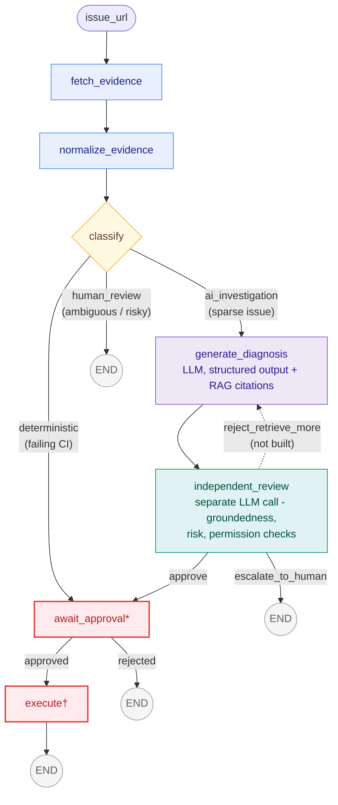

<div align="center">

# ResolveFlow


### A LangGraph agent that diagnoses GitHub issues and proposes fixes — but never touches GitHub without passing an independent LLM review *and* an explicit human approval.

[](pyproject.toml)
[](graph/build.py)
[](app/main.py)
[](frontend)
[](docs/CHECKPOINTING.md)
[](tools/retrieval.py)
[](graph/nodes)


**Live:** [resolveflow-web-officialbidishas-projects.vercel.app](https://resolveflow-web-officialbidishas-projects.vercel.app) &middot; API: [resolveflow-1h99.onrender.com](https://resolveflow-1h99.onrender.com/api/health)

</div>

<br>

ResolveFlow takes a GitHub issue URL, gathers evidence, classifies the
issue, and — depending on that classification — either runs a
deterministic action, kicks off an LLM investigation with cited retrieval,
or escalates straight to a human. The core architectural bet: **reasoning
and execution are separated by construction, not convention.** A second,
independent LLM call reviews the first model's diagnosis before anything
reaches a human for approval, and the single node allowed to write to
GitHub refuses to run without an explicit `approved` flag — checked in the
node itself, not just at an API boundary.

**Contents:** [Why this exists](#why-this-exists) · [Architecture](#architecture)
· [Core concepts](#core-concepts) · [Status](#status) · [Setup](#setup) ·
[Evaluation](#evaluation) · [Running](#running) · [Roadmap](#roadmap)

## Why this exists

This is a portfolio project, built to show a real, working slice of
agentic system design: state machines over prompt chains, a hard boundary
between the part of the system that reasons and the part that acts, and
an evidence/citation trail a reviewer can actually audit. It is not
trying to be production-hardened — see [Status](#status) for exactly what
is real, what is a deliberate placeholder, and what is simply unbuilt.

## Architecture



<sub>🔴 red = the human-approval gate and the only node with side effects &nbsp;·&nbsp; 🟣 purple = LLM reasoning &nbsp;·&nbsp; 🟢 teal = the independent LLM reviewer &nbsp;·&nbsp; 🟡 amber = deterministic routing &nbsp;·&nbsp; 🔵 blue = evidence gathering</sub>

`*` `await_approval` builds the exact comment/label that would be posted,
then pauses via LangGraph's `interrupt()` — every path to `execute` goes
through this same gate, none skip it. The paused run resumes with
`Command(resume=True/False)`, using the same `thread_id` (requires a
checkpointer, see `graph/build.py`).

`†` `execute` is the only node with side effects
(`tools/github_client.py`'s `post_comment` / `add_label`). It posts
`state["proposed_action"]` **verbatim** — the exact thing shown at the
approval gate, never recomputed — and refuses to run at all without
`state["approved"] is True`, checked in the node itself as a second,
independent guarantee on top of the graph routing.

## Core concepts

The interesting engineering in this project isn't any single LLM call —
it's the handful of structural decisions that keep those calls from being
trusted more than they've earned.

### Reasoning and execution are different code paths, not different prompts

Every node up through `independent_review` only ever *proposes*.
`execute` is the only function in the codebase allowed to call
`tools/github_client.py`'s writes, and it isn't reachable except through
`await_approval`'s gate — not by graph routing convention, but because
`execute` itself refuses to run without `state["approved"] is True`,
checked in the node body. If a future refactor added a shortcut edge
straight to `execute`, this check would still catch it. The alternative —
trusting a prompt to "always ask before acting" — fails exactly when it's
needed most, since that's a behavior, not a boundary.

### Independent review is a second call, not a second opinion from the same call

`independent_review` critiques `generate_diagnosis`'s output with a
separate `ChatOpenAI` invocation and its own prompt — "independent" is
enforced by *not sharing a reasoning trace*, not by asking the same model
to "double check itself" in one call. More importantly, the actual
approve/escalate decision (`groundedness_ok`, `risk_ok`, `permission_ok`)
is three booleans **computed in Python**, not parsed from the LLM's
response. The second model call only ever produces `reasoning` — a
human-readable critique nobody's approval hinges on. This is the general
shape for any "LLM-as-judge" pattern that has to be trustworthy: the
judge explains, code decides.

### RAG grounding is checked, not assumed

A citation being a real, retrieved snippet id used to be enough to count
as "grounded" — but a real id can still point at a snippet that's barely
related to the issue at hand, if that's simply the closest match a small
corpus has to offer. `tools/retrieval.py` now returns each snippet's
cosine similarity alongside its text; `independent_review.py` requires
every cited id to clear `MIN_RELEVANCE_SCORE` (0.35, picked by directly
measuring real query scores — see the module docstring for the actual
numbers, not a guess) before counting as grounded. A genuinely novel
issue with nothing similar in the corpus now correctly falls through to
`escalate_to_human`, instead of a confident-sounding diagnosis getting
rubber-stamped on noise. This is the retrieval-quality analogue of the
same principle above: don't let "the model cited something" stand in for
"the model cited something real."

### A paused run is real state, not a client-side illusion

`await_approval` doesn't just show a preview and wait for a button click
— it calls LangGraph's `interrupt()`, which actually **suspends the
graph's execution mid-run**. Resuming requires the same `thread_id` and a
real checkpointer (`AsyncPostgresSaver` in production; Render's free-tier
disk is ephemeral, so a local-file checkpointer would silently lose every
pending approval across a container recycle). "Approve" and "reject" on
the frontend are `Command(resume=True/False)` calls into a graph that
has been sitting paused in Postgres, possibly for hours, across
completely separate HTTP requests. See
[`docs/CHECKPOINTING.md`](./docs/CHECKPOINTING.md) for the mechanism in
detail, with a sequence diagram.

### Writes run as the person who approved them

The live app lets any GitHub user sign in and drive an analysis — reads
and writes for that run use *their* OAuth token
(`state["github_token"]`), not one shared credential belonging to the
deployment owner. That's not just an auth nicety: it's what makes "the
person approving this posted it" a statement GitHub itself can verify,
rather than something ResolveFlow merely claims in its UI. It also means
GitHub's own permission model does real work for free — a visitor
analyzing someone else's repo can comment (open to any authenticated
user) but can't necessarily add a label (needs triage/write access on
that repo), and `execute.py` treats that as a partial success rather
than crashing the whole request (see `CHANGELOG.md`).

### Two different bars for two different kinds of eval

`eval/`'s suite (`uv run python -m eval.harness`) is a **regression**
suite: `classify()`'s routing precedence, `independent_review()`'s gate,
`execute()`'s permission check — each has one unambiguous correct answer,
and the bar is 100% forever (`pass^k`: one bypassed gate across any
number of trials is a critical failure, not something to average away).
That's a different bar from a **capability** eval on
`generate_diagnosis`'s actual diagnosis quality, which is model-graded,
expected to improve over time, and never was going to sit at 100% — see
the Roadmap. Conflating the two is a common mistake: a safety gate that
"mostly" holds isn't a safety gate.

## Status

| Piece | State |
|---|---|
| `fetch_evidence` / `normalize_evidence` | ✅ Real GitHub REST calls, validated into `IssueEvidence` |
| `classify` | ✅ Rule-based routing (deliberate — see the node's docstring) |
| `generate_diagnosis` | ✅ Real OpenAI call, structured `Diagnosis` output with citations, grounded via real Pinecone retrieval |
| `independent_review` | ✅ Separate OpenAI critique call; approve/escalate gate computed in code, not trusted from the LLM |
| Retrieval corpus | ✅ Real Pinecone index, ~2,750 chunks, weekly auto re-ingest, relevance-gated citations. <details><summary>details</summary>`ingest.py` builds a real Pinecone index (`resolveflow-issues`, ~2,750 chunks) from closed issues across 4 real repos (`facebook/react`, `langchain-ai/langchain`, `microsoft/terminal`, `vercel/next.js`; `text-embedding-3-small`), self-healing (creates the index if missing), idempotent (clears stale vectors before re-ingesting). `.github/workflows/reingest.yml` re-runs it weekly so the index doesn't go stale without manual intervention (needs `OPENAI_API_KEY`/`PINECONE_API_KEY` as repo secrets — see Setup). `tools/retrieval.py` queries it directly, now surfacing each snippet's cosine similarity `score`; `independent_review.py`'s `groundedness_ok` gate requires citations to clear `MIN_RELEVANCE_SCORE` (0.35, calibrated against real query scores — see the node's docstring), not just be a real-but-possibly-irrelevant retrieved id. That's the "detect bad retrieval and recover" half: a genuinely novel issue with no real corpus match now correctly escalates to human rather than getting confidently rubber-stamped on noise. Verified against real issues end-to-end: correct, specific, citation-grounded root-cause diagnoses on real bugs — see `CHANGELOG.md` for `facebook/react#36932`.</details> |
| `execute` + human approval gate | ✅ Real `interrupt()` pause, resumed via `Command(resume=...)`, verified byte-for-byte end-to-end. <details><summary>details</summary>`await_approval` builds the proposed comment/label and pauses via `interrupt()`; every path to `execute` goes through it. `execute` posts that exact payload via `tools/github_client.py`, gated on `state["approved"]`. The deployed FastAPI backend drives the real approve/reject flow via `Command(resume=...)`, checkpointed with `AsyncPostgresSaver`. Verified end-to-end (mocked GitHub reads/writes, real OpenAI + Pinecone calls): interrupt payload and posted content match exactly. See [`docs/CHECKPOINTING.md`](./docs/CHECKPOINTING.md) for the resume mechanism in detail, with a sequence diagram.</details> |
| React frontend + FastAPI backend | ✅ Deployed (Vercel + Render), async backend, Postgres-checkpointed, live pipeline stepper. <details><summary>details</summary>`frontend/` (Vite + React + TypeScript) talks to `app/main.py` (FastAPI) over HTTP — the only deployed surface. Backend is fully async and uses `AsyncPostgresSaver` (a real Postgres instance) as its checkpointer — not local SQLite, which Render's free-tier ephemeral disk wipes on every spin-down/spin-up, silently losing any paused approval. `vercel.json` proxies `/api/*` to the Render backend so the session cookie is first-party to the browser, not a cross-site cookie Chrome would otherwise block. The UI renders a live pipeline stepper (`fetch → classify → diagnose → review → approve → execute`) computed directly from the same `GraphResult` the rest of the page renders — not decorative, and correctly shows `deterministic`/`human_review`/`escalate_to_human` paths as skipping steps they'll never reach, rather than stuck "pending" forever. Deployed: frontend on Vercel, backend on Render. Verified end-to-end on the live production URLs.</details> |
| GitHub OAuth ("Sign in with GitHub") | ✅ Any visitor signs in with their own account; writes run as them, bounded by a per-user daily cap. <details><summary>details</summary>Any visitor can sign in with their own GitHub account; reads/writes then run as *them*, not the deployment owner's shared `GITHUB_TOKEN`. `app/db.py` adds a `sessions` table (opaque cookie -> real token, kept server-side), a `thread_owners` table (a paused run can only be resumed by the session that started it), and a per-user `analyze_calls` daily cap — all in the same Postgres as the checkpointer, on a separate connection pool. The owner's `OPENAI_API_KEY`/`PINECONE_API_KEY` still fund every diagnosis regardless of who's asking, which is exactly what the daily cap bounds.</details> |
| `eval/` | ✅ Two-tier eval framework: <details><summary>safety gates + capability evals</summary>**Safety-gate regression suite** (`eval/harness.py`): `classify()`'s routing precedence, `independent_review()`'s groundedness/risk gate, `execute()`'s permission check + verbatim-posting (GitHub writes mocked — never real). Code-graded, `pass^k` semantics: 12/12 passing, and the bar is 100% forever (one bypassed gate across trials is a critical failure, not an average). Run with `uv run python -m eval.harness`.<br><br>**Capability eval suite** (`eval/capability_harness.py`, *new*): Tests `generate_diagnosis` output quality (severity enum, citation grounding, retrieval relevance) against real issues extracted from the Pinecone corpus. Model-graded, expected to improve over time, different bar from safety gates. Currently 6/6 passing. Run with `uv run python -m eval.capability_harness`. Extract fresh test cases from your corpus with `python -m eval.extract_real_test_cases` (re-run whenever you re-ingest).</details> |
| Tests | ❌ Unit/integration tests not written yet. |

See [`CHANGELOG.md`](./CHANGELOG.md) for the build history, and
[`PLAN.md`](./PLAN.md) for the original 5-day/2-person plan this was
compressed from into a solo, thinner end-to-end slice.

## Setup

```bash
uv sync                  # installs from pyproject.toml
cp .env.example .env     # fill in GITHUB_TOKEN, OPENAI_API_KEY, PINECONE_API_KEY, DATABASE_URL
```

To let visitors sign in with their own GitHub account (rather than every
request running under `GITHUB_TOKEN`), create a GitHub OAuth App at
[github.com/settings/developers](https://github.com/settings/developers)
with its callback URL set to `<your backend>/api/auth/github/callback`,
then fill in `GITHUB_OAUTH_CLIENT_ID` / `GITHUB_OAUTH_CLIENT_SECRET` /
`FRONTEND_URL` in `.env` (see `.env.example` for details, including the
HTTPS-only caveat on the session cookie).

For the weekly re-ingest workflow to run, add `OPENAI_API_KEY` and
`PINECONE_API_KEY` as repository secrets (Settings → Secrets and
variables → Actions → New repository secret) — the same values already
in your `.env`. `GITHUB_TOKEN` doesn't need to be added; Actions provides
one automatically, sufficient for the read-only calls `ingest.py` makes.

## Evaluation

ResolveFlow has **two kinds of evals**, each with its own bar and semantics:

### Safety Gates (Regression Suite)
**Bar:** 100% forever. One failure = critical bug.

```bash
uv run python -m eval.harness
```

Tests the hard boundaries: `classify()`'s routing, `independent_review()`'s gates, `execute()`'s permission check. Each test has one unambiguous correct answer. Failures indicate the system weakened, not that it needs more training data.

**Current:** 12/12 passing

### Capability Evals
**Bar:** Model-graded, expected to improve over time.

```bash
# Extract real test cases from your Pinecone corpus
python -m eval.extract_real_test_cases

# Run capability evals against those real issues
uv run python -m eval.capability_harness
```

Tests output quality on `generate_diagnosis`: Is the severity a valid enum? Do citations match retrieved IDs (no hallucinations)? Are retrieved snippets actually relevant?

**Current:** 6/6 passing on real issues from facebook/react and microsoft/terminal

**Re-run `extract_real_test_cases` after each `ingest.py` run** to test against the latest corpus.

Why two eval types? A safety gate that "mostly" works isn't a gate at all. The ability to diagnose issues well is a different bar — it *should* improve as the corpus grows and the prompt tunes, and averaging failures together obscures what's actually broken.

## Running

```bash
uv run uvicorn app.main:app --reload                     # FastAPI backend, for the React frontend
cd frontend && npm install && npm run dev                # React frontend (localhost:5173)
uv run python ingest.py                                  # (re)populate the Pinecone index from live GitHub issues
python -m eval.extract_real_test_cases                   # extract test cases from corpus
uv run python -m eval.harness                            # run safety-gate regression tests
uv run python -m eval.capability_harness                 # run capability evals
uv run pytest                                             # once tests exist
```

Live: see the badges/links above. No local UI is needed to try it — the deployed frontend talks to the deployed backend directly.

## Roadmap

1. ✅ **Capability eval suite for `generate_diagnosis`** — model-graded diagnosis quality against real issues from the Pinecone corpus. Currently tests severity enum validity and citation grounding (no hallucinations). Extensible for retrieval quality, recommendation grounding, and consistency.
2. **More capability eval types** — retrieve relevance, recommendation grounding, diagnosis consistency (same issue → same diagnosis).
3. **CI/CD integration** — run both safety-gate and capability suites on every commit; set thresholds for gating deploys.
4. **Live monitoring** — scheduled daily eval runs on production to catch regressions.
5. Tests for the node functions and the compiled graph.
