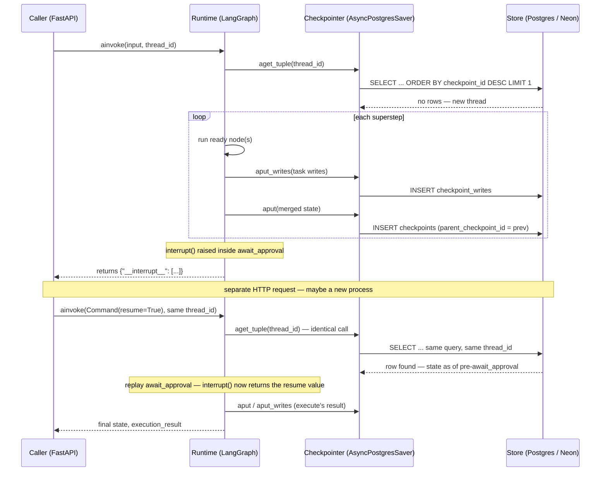

# Checkpoint resume mechanics

How `app/main.py`'s checkpointer persists a paused `interrupt()` across
two genuinely separate HTTP requests — and why that's the whole reason
it's `AsyncPostgresSaver` and not `SqliteSaver`.

## The problem this replaces

The prior checkpointer, `SqliteSaver`, wrote to a local file
(`checkpoints.db`) on the backend's disk. On Render's free tier, that
disk is **ephemeral** — every spin-down/spin-up cycle after idle time
hands the app a fresh container, and local disk contents don't survive
that recycle.

Concretely: a run pauses at `await_approval` waiting on a human; the
free instance idles out before anyone clicks Approve; the next request
boots a new container with an empty `checkpoints.db`. The paused
thread's history is simply gone — `Command(resume=...)` has nothing to
resume.

A checkpointer backed by a real database server isn't on the app host's
disk at all. The container can be destroyed and rebuilt entirely — as
long as `DATABASE_URL` still points somewhere real, every paused thread
survives. That's the entire justification for the swap; nothing about
`interrupt()`'s own logic changed.

## The contract a checkpointer implements

LangGraph's runtime is written against one abstract interface — four
async methods are all it needs, and it has no idea Postgres is
underneath:

| Method | Purpose |
|---|---|
| `aget_tuple()` | Fetch the latest checkpoint for a `thread_id` (or a specific one, given a `checkpoint_id`). |
| `aput()` | Persist a fully-merged state snapshot as a new checkpoint, linked to its parent. |
| `aput_writes()` | Stage one task's output before the whole superstep is merged — so a crash mid-superstep doesn't lose completed work. |
| `alist()` | Enumerate checkpoints for a thread — history/time-travel; not exercised by this app today. |

## The mechanism



The key thing this diagram makes explicit: **both `ainvoke()` calls run
the exact same `aget_tuple` query.** There is no separate "resume" code
path in the checkpointer. The only difference between "a fresh run" and
"a resume" is whether a row already happens to exist for that
`thread_id` when the query runs.

## The schema behind it

Three tables, created by `saver.setup()` — confirmed by querying
`pg_tables` directly against the live database after running it:

```sql
CREATE TABLE checkpoints (
    thread_id TEXT NOT NULL,
    checkpoint_ns TEXT NOT NULL DEFAULT '',
    checkpoint_id TEXT NOT NULL,
    parent_checkpoint_id TEXT,        -- links to the previous checkpoint
    checkpoint JSONB NOT NULL,        -- the full serialized GraphState
    metadata JSONB NOT NULL DEFAULT '{}',
    PRIMARY KEY (thread_id, checkpoint_ns, checkpoint_id)
);

CREATE TABLE checkpoint_writes (      -- one task's staged output,
    thread_id TEXT NOT NULL,          -- written before the whole
    checkpoint_ns TEXT NOT NULL,      -- superstep is merged
    checkpoint_id TEXT NOT NULL,
    task_id TEXT NOT NULL,
    idx INTEGER NOT NULL,
    channel TEXT NOT NULL,
    blob BYTEA NOT NULL,
    PRIMARY KEY (thread_id, checkpoint_ns, checkpoint_id, task_id, idx)
);

CREATE TABLE checkpoint_blobs (       -- large channel values, stored
    thread_id TEXT NOT NULL,          -- once and referenced rather than
    checkpoint_ns TEXT NOT NULL,      -- duplicated inline
    channel TEXT NOT NULL,
    version TEXT NOT NULL,
    blob BYTEA,
    PRIMARY KEY (thread_id, checkpoint_ns, channel, version)
);
```

Nothing is ever updated in place — every superstep inserts a **new**
`checkpoints` row with `parent_checkpoint_id` pointing at the previous
one. That's what makes a thread's full history genuinely replayable,
not just its latest state.

## One more fix that rides along: `graph/serde.py`

Every checkpoint round-trips `GraphState` through msgpack. Without
telling the serializer which Pydantic classes are safe to
(de)serialize, a future LangGraph version enforcing
`LANGGRAPH_STRICT_MSGPACK` would refuse to store `IssueEvidence`,
`Diagnosis`, or `ReviewResult` at all — this was previously a logged
deprecation warning on every resume.

```python
# graph/serde.py
from langgraph.checkpoint.serde.jsonplus import JsonPlusSerializer

_ALLOWED_MSGPACK_MODULES = [
    ("schemas.evidence", "IssueEvidence"),
    ("schemas.evidence", "CheckRun"),
    ("schemas.evidence", "LinkedPR"),
    ("schemas.diagnosis", "Diagnosis"),
    ("schemas.review", "ReviewResult"),
]

def get_serde() -> JsonPlusSerializer:
    return JsonPlusSerializer(allowed_msgpack_modules=_ALLOWED_MSGPACK_MODULES)
```

Passed into both checkpointers that exist in this codebase —
`graph/build.py`'s in-process `MemorySaver`, and `app/main.py`'s
`AsyncPostgresSaver` — so the fix applies regardless of which one is
active.

## What's actually been verified

- ✅ `saver.setup()` against the live Neon instance — 4 tables created
  (`checkpoints`, `checkpoint_writes`, `checkpoint_blobs`,
  `checkpoint_migrations`), confirmed via `pg_tables`.
- ✅ `app/main.py`'s real `lifespan` connects successfully on startup —
  not just an isolated test script.
- ✅ Two full real `analyze()` runs (real GitHub + OpenAI + Pinecone
  calls) completed and were checkpointed at each step.
- ❌ `interrupt()` → `Command(resume=...)` specifically — not yet
  exercised end-to-end against the real database. Both real issues
  tried during verification escalated to a human before ever reaching
  `await_approval` (correct, conservative behavior — `severity: high`
  always escalates by design — not a gap in this fix).
